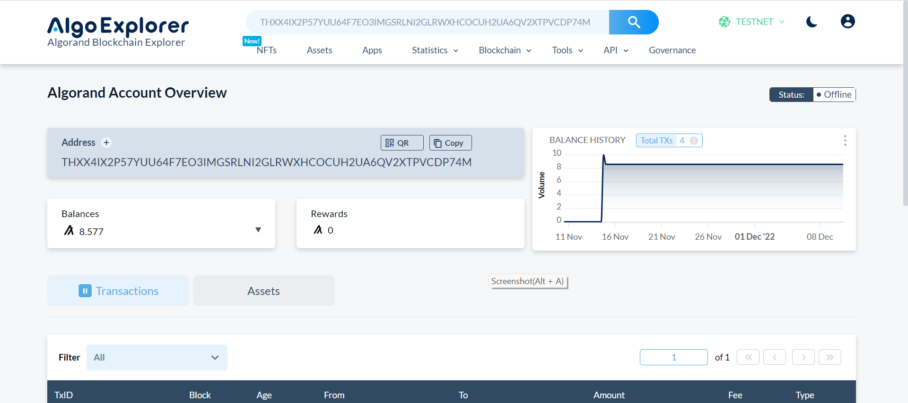

# Example of Filled-Out Form 
## Step 1.1:

* Address of account A: `THXX4IX2P57YUU64F7EO3IMGSRLNI2GLRWXHCOCUH2UA6QV2XTPVCDP74M`
* Address of account B: `LNYQGZDXDPAPGLBNYBPZFQT7QTOIRGSUMFL66NKSANO2OYAAALKOCQCPLI`

## Step 2:

* Transaction ID from account A: `ODMWBUUFTYWVCZPHWN5BBTFP4BE7CCXA7VGQQTVVSZ7ZIK5JTNWA`

* Transaction ID from account B: `7WE6ZUQVIONWCYPNMXS7CT6PGMM5LXAPXNPXY5PH5A3TYGXZRRVQ`

## Step 3.1:

* Asset ID: 122789265
* Name of the asset: `TestAsset`

## Step 3.2:

* Transaction ID for opt-in of account B: `JCQRX7V2XGPY2ZPFCZRM43WZQYJFNUO6BOCMBE2MWXCWIL2HWIHA`

## Step 3.3:

* Transaction ID for transfer of asset from A to B: `LYPFP47CQAS2TNTRVZQABGAKWL2JUTMW4WXVLKUTRQTB5KGCRHJQ`

## Step 4:

* Transaction ID of the first transaction of the atomic transfer: `7MSQY2M7I7F7EYHPDWBBHUSLA37JYBCWMIL7NLX2RICJ3WDAJDOA`
